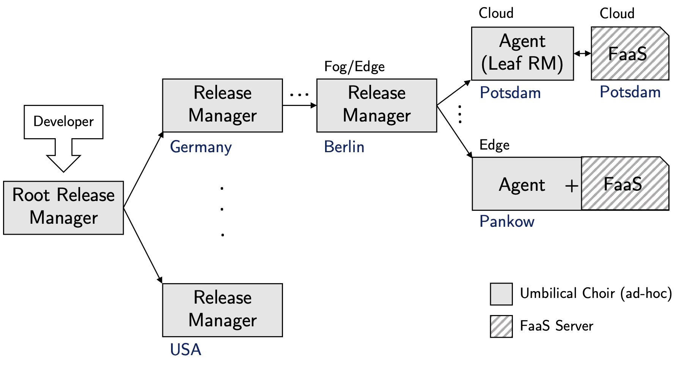
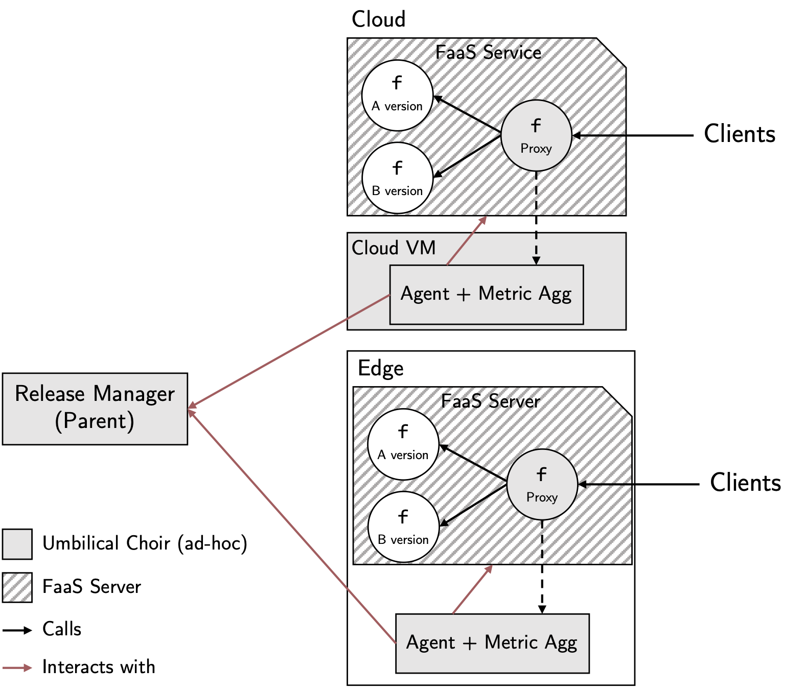

Umbilical Choir: Automated Live Testing for Edge-To-Cloud FaaS Applications
----------------
Application users react negatively to performance regressions or availability issues across software releases.
To address this, modern cloud-based applications with their multiple daily releases rely on live testing techniques such as A/B testing or canary releases.
In edge-to-cloud applications, however, which have similar problems, developers currently still have to hard-code custom live testing tooling as there is no general framework for edge-to-cloud live testing.

With **UC**, we partially close this gap for serverless edge-to-cloud applications.
UC is compatible with all Function-as-a-Service platforms and (extensively) supports various live testing techniques, including canary releases with various geo-aware strategies, A/B testing, and gradual roll-outs.

High-level Architecture of Umbilical Choir:   


Agent Interaction Architecture During a Live Test:  


Read our paper for more information:

## Research

If you use any of Umbilical Choir's software components ([Release Manager](https://github.com/ChaosRez/umbilical-choir-release-manager), [Proxy](https://github.com/ChaosRez/umbilical-choir-proxy), and [Agent](https://github.com/ChaosRez/umbilical-choir-core)) in a publication, please cite it as:

### Text

M. Malekabbasi, T. Pfandzelter, and D. Bermbach, **Umbilical Choir: Automated Live Testing for Edge-To-Cloud FaaS Applications**, 2025.

### BibTeX

```bibtex
@inproceedings{malekabbasi2025umbilical,
    author = "Malekabbasi, Mohammadreza and Pfandzelter, Tobias and Bermbach, David",
    title = "Umbilical Choir: Automated Live Testing for Edge-to-Cloud FaaS Applications",
    booktitle = "Proceedings of the 9th IEEE International Conference on Fog and Edge Computing",
    pages = "11--18",
    month = may,
    year = 2025,
    acmid = MISSING,
    publisher = "IEEE",
    address = "New York, NY, USA",
    series = "ICFEC '25",
    location = "Tromso, Norway",
    numpages = MISSING,
    url = "https://doi.org/10.1109/ICFEC65699.2025.00010",
    doi = "10.1109/ICFEC65699.2025.00010"
}
```

----------------
# Umbilical Choir: Agent (leaf node [Release Master](https://github.com/ChaosRez/umbilical-choir-release-manager))
While RMs delegate release strategies to their child nodes, Agents have access to (typically nearby) FaaS services which they use to execute release strategies received from their parent RM.
The Agent is responsible for deploying all function versions as well as the proxy function and then running the live test and collecting metrics.

While UC Agent is basically the UC Release Manager with no child nodes, we developed it as a separate repository for simplicity and modularity.

For other repositories of this project, see the [Umbilical Choir Release Manager](https://github.com/ChaosRez/umbilical-choir-release-manager) and [Umbilical Choir Proxy](https://github.com/ChaosRez/umbilical-choir-proxy) repositories.

## Writing release strategies
The release strategy is defined in a human-readable YAML format. Check Umbilical Choir [Release Manager](https://github.com/ChaosRez/umbilical-choir-release-manager) for samples.
### stage's "end_action"
The `end_action` of a stage can be one of the following on `onSuccess` and `onFailure` keys:
```yaml
onSuccess: rollout # or rollback, or a specific (next) stage 
onFailure: rollback
```
### stage's type
The `type` of a stage can be one of the following:
```yaml
type: A/B
type: WaitForSignal
```
The `WaitForSignal` mode actively poll for an end signal from the parent node.
Request payload:
```go
request := map[string]interface{}{
"id":          id,
"strategy_id": strategyID,
"stage_name":  stageName,
}
```
Response payload:
```go
var response struct {
EndTest bool `json:"end_stage"`
}
```

## Function Format
For nodejs functions, the agent expects an "index.js" file where the main function is defined in a outer `moudle`/`exports` format.
For python functions, the agent expects a "fn.py" file where the main function is defined in a outer `def fn(input: typing.Optional[str], headers: typing.Optional[typing.Dict[str, str]]) -> typing.Optional[str]:` format (tinyFaaS standard format).

## Supported FaaS Providers
At this time, the agent supports the following FaaS nodes and Runtimes:
- tinyFaaS (self hosted)
  - nodejs, python3, and go (partial support)
  - it is suggested to host the agent on the same machine as FaaS server (e.g. tinyFaaS) where possible
- AWS Lambda
  - TBD
- Google Functions
  - nodejs20, python312, go122
- Azure Functions
  - TBD

### tinyFaaS
We use [tinyfaas-go](https://github.com/ChaosRez/go-tinyfaas) go wrapper for intracting with tinyFaaS

### GCP Functions
The GCP Functions SDK is not well-documented, has multiple incompatible versions, and is not backward-compatible.
They are moving Functions completely to Cloud Run.
So, if reusing/publishing any part, please attribute it to me (@chaosRez) and cite our paper (see project README.md).
The agent doesn't use the `gcloud` CLI to deploy functions to GCP.
Instead, it uses the recent GCP API to interact with the GCP Functions service, which took a lot of time to figure out with a working version supporting IAM and needed features.
However, you need to set Application Default Credentials (ADC) in your environment using `gcloud` or simply use a credentials file mentioned below.
The second option is suggested since agents are supposed to run on multiple ad-hoc machines in the same region as the associated GCP Function instance.
A Google Cloud Platform project set up with appropriate permissions enabled is needed.
For more complex scenarios, refer to the official [go-cloud documentation](https://cloud.google.com/functions/docs/concepts/go-runtime).

The function source priority is as follows:
1. SourceZipURL
2. SourceLocalPath
3. SourceGitRepoURL

Pre-requisites:
1. **Enable Google Cloud Functions API**:
    - Go to the [Google Cloud Console](https://console.developers.google.com).
    - Select your project e.g. `umbilical-choir`.
    - Navigate to `APIs & Services` > `Library`.
    - Search for `Cloud Functions API` and ensure it is enabled.

2. **Grant Permissions**:
    - Go to the [IAM & Admin](https://console.cloud.google.com/iam-admin/iam) section in the Google Cloud Console.
    - Find the service account or user that you are using to deploy the function.
    - Ensure the service account or user has the `Cloud Functions Admin` role. You can add this role by clicking on `Add` and selecting `Cloud Functions Developer`.
    - Do the same for the `Storage Object Admin` role. Which is needed to upload the function source code.
    - It is suggested to use credentials file for authentication from [service accounts](https://console.cloud.google.com/iam-admin/serviceaccounts).
    - In Gen2 functions, you have to assign the “allUsers” principal so the function can publicly be available. For this, [Cloud Resource Manager API](https://console.cloud.google.com/apis/library/cloudresourcemanager.googleapis.com) should be enabled. This is needed for IAM 

## Build
```
GOOS=linux GOARCH=arm64 go build -o agent-arm cmd/main.go  # for raspberry
GOOS=linux GOARCH=amd64 go build -o agent-amd cmd/main.go  # for amd cloud
```
### Send sources directly to a server
GCP amd64:
```aiignore
gcloud compute scp agent-amd "uc-agent-berlin:umbilical-choir/agent" --zone "europe-west10-b"
```
Raspberry:
```aiignore
scp agent-arm raspi-alpha:/home/pi/Documents/umbilical-choir/agent/
```

## Contributing
For contributions, please fork the repository and create a pull request, or contact authors directly.

## Acknowledgement
This repository is part of the [Umbilical Choir](https://github.com/ChaosRez/umbilical-choir-core) project.
If you use this code, please cite our paper and reference this repository in your own code repository.
